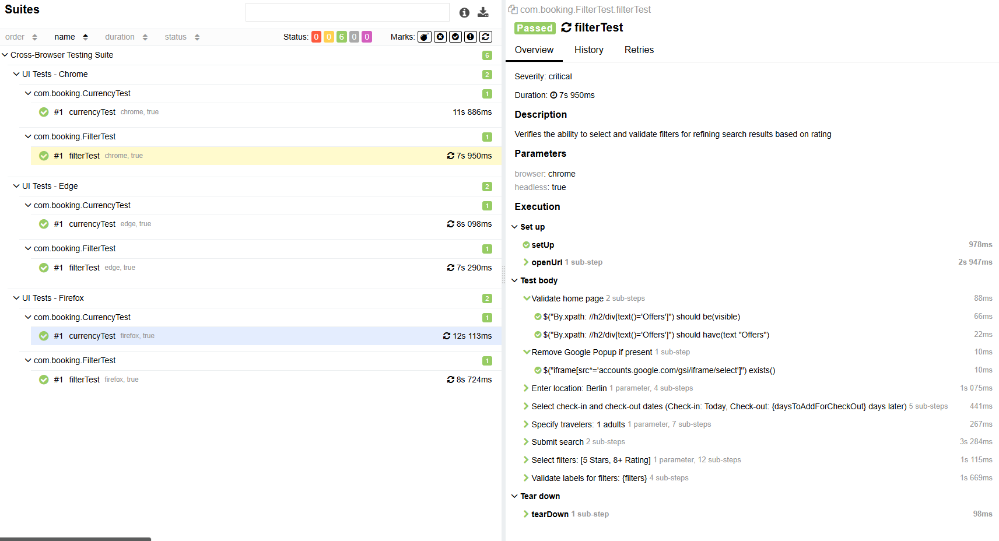
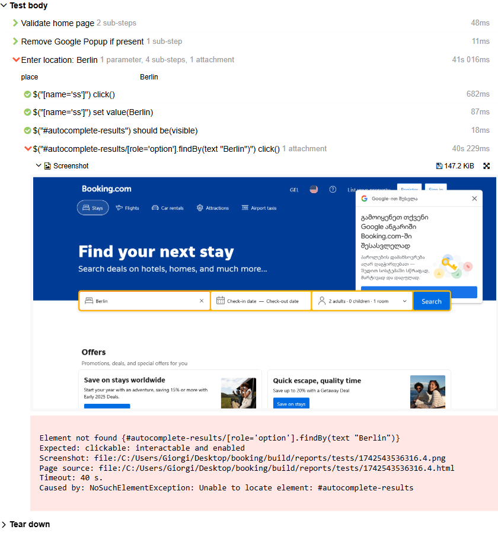

# Booking Test Automation

This project provides automated test cases for the Booking website using **Selenide** and **TestNG**. The tests cover functionalities like currency selection and filter application on the search results page. The tests are executed on multiple browsers (Chrome, Edge, Firefox) with headless support enabled.

## Project Structure

- **com.booking**: Contains the core test automation code.
    - **BaseTest**: The base class for setting up the WebDriver and managing browser configurations.
    - **CurrencyTest**: Test case for verifying the currency selection functionality.
    - **FilterTest**: Test case for verifying the filter functionality on the search results page.
    - **Steps**: Contains page-object model (POM) steps for interacting with the various elements on the pages (e.g., Landing Page, Search Results Page, Currency Page, Filter Page).
    - **retry**: Contains the custom retry analyzer for tests.

### Allure Report

Here’s an example of an Allure report screenshot, which includes detailed test case information and test execution results:

### Test Failure

Below is an example of a failed test scenario showing the screenshot of the failure:

